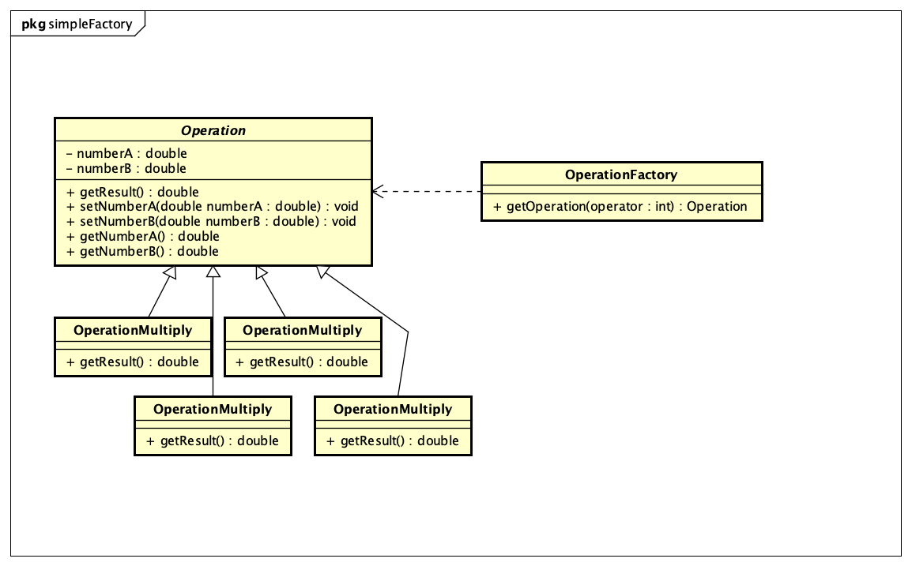

# DesignPatternDemo
This is the demo project about studying the book called 《大话设计模式(Design Pattern)》.

## 1 Simple Factory 
Use a specific class to create instance of a series of classes who extend the same parent class.
